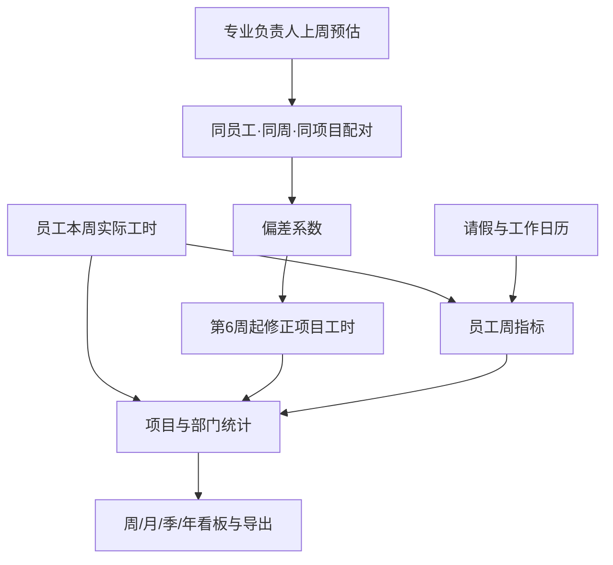

# 架构说明

## 目标与边界

载衡为约几十名员工、几十个并发项目的设计部门提供周粒度的人力管理。当前数据模型预留 `department_id`，但产品交互仍以单部门为主。

## 运行架构

```mermaid
flowchart LR
    U[浏览器] -->|HTTP(S)| A[Go 单体应用]
    A --> S[(SQLite)]
    A --> E[嵌入模板与静态资源]
    A --> B[备份、恢复与导出]
```

应用不需要独立前端构建、缓存服务或独立数据库服务。SQLite 使用 WAL、外键、繁忙等待和有限连接池。

## 代码分区

|区域|职责|
|-|-|
|`main.go`、`config.go`|CLI、配置和 HTTP 服务生命周期|
|`app.go`、`auth.go`、`security.go`|路由、中间件、会话、CSRF、密码和安全响应头|
|`database.go`、`db/schema.sql`|建库、兼容迁移、基础权限和系统设置|
|`worklog*.go`、`forecast.go`|实际工时、请假、工作内容和下周预估|
|`projects*.go`|项目、阶段、子项、负责人、完成和删除保护|
|`dashboard.go`、`department.go`、`period_analytics.go`|个人、部门与周期看板|
|`bias.go`、`calculations.go`|偏差系数、修正工时与负荷算法|
|`export*.go`、`xlsx.go`|个人和部门 Excel 导出|
|`backup*.go`|在线备份下载、校验和恢复|
|`web/templates`、`web/static`|服务端模板、CSS、JavaScript 和品牌资源|

## 权限模型

业务层级为设计师、专业负责人和部门领导，高层级默认包含低层级业务能力；系统管理员是独立标记。实际权限由角色默认值与个人覆盖共同计算。

所有 POST 业务操作都应同时满足：

1. 有效登录会话；
2. 首次密码修改要求；
3. 对应权限或对象级负责人判断；
4. CSRF 令牌；
5. 必要的审计记录。

## 主要数据流



临时“其它”工时计入员工和部门负荷，但不进入项目工时和偏差系数。工地驻场保留为项目工时中的独立类别。

## 数据兼容

`db/schema.sql` 创建完整新库，`ensureSchemaColumns` 为旧库补充新增列。任何新迁移都必须保持已有生产数据，恢复功能会按新旧数据库共有列复制数据，再执行当前迁移与默认值填充。

## 信任边界

- 浏览器输入：表单、上传图片和恢复文件均视为不可信。
- 网络入口：公开访问时应使用 HTTPS；具体网络和运行方式由使用者决定。
- 数据库和备份：包含个人信息、密码哈希、会话、项目和工时，绝不能进入公开仓库。
- 登录背景：管理员上传图片存入数据库；公开源码只提供原创抽象 SVG 默认背景。
